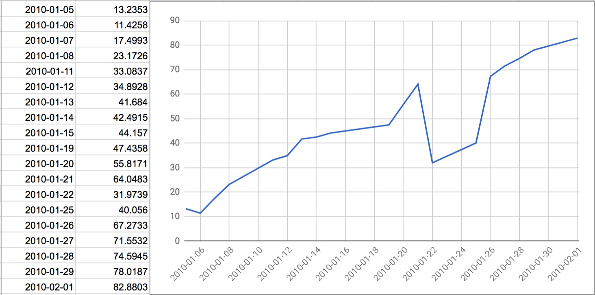

Indicators
============================


## Relative Strength Index (RSI)

### Calculation

```
( 100.0 - ( 100.0 / ( 1.0 + rs ) ))
where rs = average gains / average losses
```

### Bullish Failure Swing



### Bearish Failure Swing

(todo)

## Simple Moving Average SMA

Average of the last x data points.  As new data points are available then the window shifts adding a new data point to the end and dropping 
the first data point in the window.
SMA is a lagging indicator used to confirm past actions.

### Calculations

```
period is the number of days in the moving window.
avg = ( ∑ values in period ) / period
```

### References

[SimpleMovingAverage](simple-moving-average.ts)

## Exponential Moving Average EMA

A weighted moving average where more weight is given to the newer data points.
EMA is a lagging indicator used to confirm past actions.


### Calculations

```
period is the number of days in the moving window.
lambda = 2 / ( 1 + period )
avg = ( ∑ values in period ) / period 
( avg * lambda ) + ( previousEMA * ( 1 - lambda ))
Initialize previousEMA with its SMA.
```

### See

[ExponentialMovingAverage](exponential-moving-average.ts)

https://www.compose.com/articles/metrics-maven-calculating-an-exponentially-weighted-moving-average-in-postgresql/

## Moving Average Convergence Divergence MACD

A lagging indicator that measures momentum by showing the relationship between two exponential moving averages of prices, usually the 26 day and 12 day EMAs.

### Calculation

```
MACD = 12 day EMA - 26 day EMA.
signal = 9 day EMA of the MACD.
histogram = MACD - signal
```

### Interpretation

#### Crossovers

If MACD falls below the signal line, signifies a bearish condition.
If MACD rises above the signal line, signifies a bullish condition.

#### Divergence

If security price diverges from the MACD, this could signify an end to the current trend.  
Divergences of MACD to price occur when one value records a new higher low or lower high while the other
records a lower low or higher high respectively.

#### Dramatic Rise

If MACD slope rises dramatically, the 12 day EMA rises faster than the 26 day EMA, this may signify an overbought condition.


### See

- [MovingAverageConvergenceDivergence](moving-average-convergence-divergence.ts)
- http://www.investopedia.com/terms/m/macd.asp
- http://stockcharts.com/school/doku.php?id=chart_school:technical_indicators:moving_average_convergence_divergence_macd

-------------------

## Chart Patterns

Bases for patterns have these quantitative attributes; depth and duration.

Duration begins in a stock's first down week after marking the left side high of the base.

### Cup with Handle Pattern

- Preconditions: 30% uptrend or 20% increase from prior breakout.
- Duration: 7 weeks or if no handle 6 weeks. Handle 5+ days but need to be less than cup in duration and depth.
- Depth: Between 8-12% and 30-33%.  In bear markets (what is a bear market?) the handle could be a double-digit decline of 40-50%.
  Shallow is better.  Volume should be light in the base and handle. 
- Handle usually forms with a down day in prices.  Proper handle should form in the upper part of the cup.
  The midpoint of the handle should be above the midpoint of the cup.   
  Midpoint of the cup or handle is the average of the highest price and the lowest price of the cup or handle.
  The handle should have a downward slope but not too steep otherwise it is flawed.
- Buy point should be the highest point of the handle + $0.10.  Volume should be 40% above its 50-day average.


### Cup Pattern

- Duration: 6 weeks
- Depth: 15% to 33%

### Flat Bases Pattern

- Duration: 5 weeks
- Depth: most likely less than 15%


### Double Bottoms Pattern

- Depth: 15% to 33%

### Ascending Bases

- Depth: 3 separate pullbacks of 15% to 20% in a stair-step fashion.


### Saucer


### IPO Base


### High, Tight Flag
