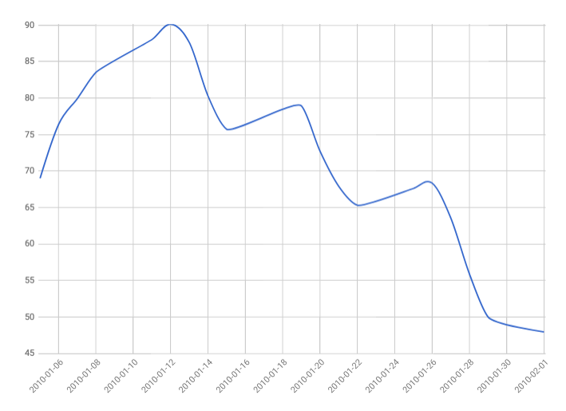
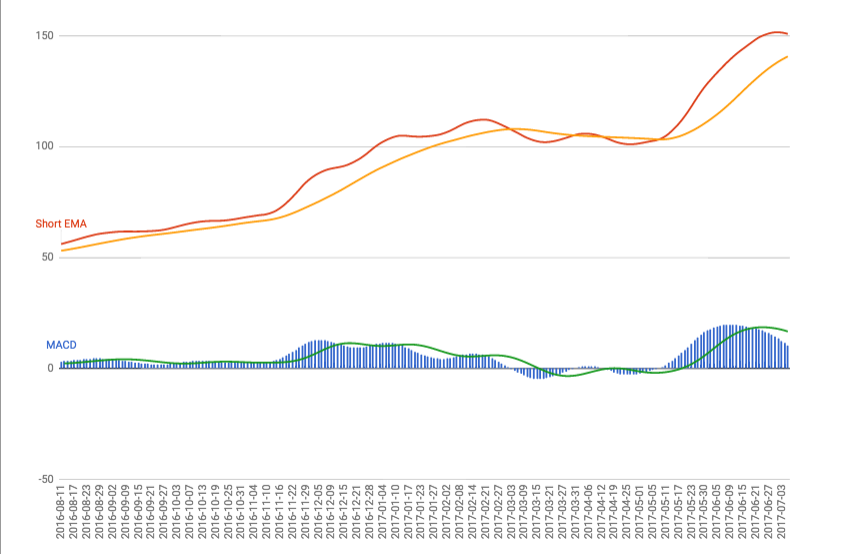

Indicators
============================

## Relative Strength Index (RSI)

A momentum oscillator that measures the speed and change of price movements.

### Calculation

```
( 100.0 - ( 100.0 / ( 1.0 + rs ) ))
where rs = average gains / average losses
```

### Bullish Failure Swing

A bullish failure swing forms when RSI moves below 30 (oversold),
bounces above 30, pulls back, holds above 30 and then breaks its prior high.  It is basically a move to oversold levels and then a higher low above oversold levels.


### Bearish Failure Swing

A bearish failure swing forms when RSI moves above 70,
pulls back, bounces, fails to exceed 70 and then breaks its prior low.  It is basically a move to overbought levels and then a lower high below overbought levels.




### See

- [RelativeStrengthIndex](relative-strength-index.ts)
- http://stockcharts.com/school/doku.php?id=chart_school:technical_indicators:relative_strength_index_rsi

## Stochastic Oscillator

```
%K = (Current Close - Lowest Low)/(Highest High - Lowest Low) * 100
%D = 3-day SMA of %K
```
Lowest Low = lowest low for the look-back period
Highest High = highest high for the look-back period
%K is multiplied by 100 to move the decimal point two places

## Simple Moving Average SMA

Average of the last x data points.  As new data points are available then the window shifts adding a new data point to the end and dropping 
the first data point in the window.
SMA is a lagging indicator used to confirm past actions.

### Calculations

```
period is the number of days in the moving window.
avg = ( ∑ values in period ) / period
```

### See

- [SimpleMovingAverage](simple-moving-average.ts)

## Exponential Moving Average EMA

A weighted moving average where more weight is given to the newer data points.
EMA is a lagging indicator used to confirm past actions.


### Calculations

```
period is the number of days in the moving window.
lambda = 2 / ( 1 + period )
avg = ( ∑ values in period ) / period 
( avg * lambda ) + ( previousEMA * ( 1 - lambda ))
Initialize previousEMA with its SMA.
```

### See

- [ExponentialMovingAverage](exponential-moving-average.ts)
- https://www.compose.com/articles/metrics-maven-calculating-an-exponentially-weighted-moving-average-in-postgresql/

## Moving Average Convergence Divergence MACD

A lagging indicator that measures momentum by showing the relationship between two exponential moving averages of prices, usually the 26 day and 12 day EMAs.

### Calculation

```
MACD = 12 day EMA - 26 day EMA.
signal = 9 day EMA of the MACD.
histogram = MACD - signal
```

### Interpretation

#### Crossovers

If MACD falls below the signal line, signifies a bearish condition.
If MACD rises above the signal line, signifies a bullish condition.

#### Divergence

If security price diverges from the MACD, this could signify an end to the current trend.  
Divergences of MACD to price occur when one value records a new higher low or lower high while the other
records a lower low or higher high respectively.

#### Dramatic Rise

If MACD slope rises dramatically, the 12 day EMA rises faster than the 26 day EMA, this may signify an overbought condition.



### See

- [MovingAverageConvergenceDivergence](moving-average-convergence-divergence.ts)
- http://www.investopedia.com/terms/m/macd.asp
- http://stockcharts.com/school/doku.php?id=chart_school:technical_indicators:moving_average_convergence_divergence_macd

-------------------

## Calculating Support and Resistance Trend Lines.

https://stackoverflow.com/questions/8587047/support-resistance-algorithm-technical-analysis

Choose a timeframe, say 100 bars, then look for local turning points, or Maxima and Minima.
 Maxima and Minima can be computed from a smoothed closing price by using the 1st and second derivative (dy/dx and d^2y/dx).
  Where dy/dx = zero and d^y/dx is positive, you have a minima, when dy/dx = zero and d^2y/dx is negative, you have a maxima.

In practical terms this could be computed by iterating over your smoothed closing price series and looking at three adjacent points.
 If the points are lower/higher/lower in relative terms then you have a maxima, else higher/lower/higher you have a minima.
  You may wish to fine-tune this detection method to look at more points (say 5, 7) 
  and only trigger if the edge points are a certain % away from the centre point.
   This is similar to the algorithm that the ZigZag indicator uses.

Once you have local maxima and minima,
 you then want to look for clusters of turning points within a certain distance of each other in the Y-Direction.
 Take the list of N turning points and compute the Y-distance between it and each of the other discovered turning points.
  If the distance is less than a fixed constant then you have found two "close" turning points, indicating possible support/resistance.

You could then rank your S/R lines, so two turning points at $20 is less important than three turning points at $20 for instance.

An extension to this would be to compute trendlines. 
With the list of turning points discovered now take each point in turn and select two other points, trying to fit a straight line equation. 
If the equation is solvable within a certain error margin, you have a sloping trendline. 
If not, discard and move on to the next triplet of points.

The reason why you need three at a time to compute trendlines is any two points can be used in the straight line equation. 
Another way to compute trendlines would be to compute the straight line equation of all pairs of turning points, 
then see if a third point (or more than one) lies on the same straight line within a margin of error. 
If 1 or more other points does lie on this line, bingo you have calculated a Support/Resistance trendline.

I hope this helps. No code examples sorry, I'm just giving you some ideas on how it could be done. In summary:

Inputs to the system

Lookback period L (number of bars)
Closing prices for L bars
Smoothing factor (to smooth closing price)
Tolerance (minimum distance between turning points to constitute a match)

Outputs

List of turning points, call them tPoints[] (x,y)
List of potential trendlines, each with the line equation (y = mx + c)

## Chart Patterns

Bases for patterns have these quantitative attributes; depth and duration.

Duration begins in a stock's first down week after marking the left side high of the base.

### Cup with Handle Pattern

- Preconditions: 30% uptrend or 20% increase from prior breakout.
- Duration: 7 weeks or if no handle 6 weeks. Handle 5+ days but need to be less than cup in duration and depth.
- Depth: Between 8-12% and 30-33%.  In bear markets (what is a bear market?) the handle could be a double-digit decline of 40-50%.
  Shallow is better.  Volume should be light in the base and handle. 
- Handle usually forms with a down day in prices.  Proper handle should form in the upper part of the cup.
  The midpoint of the handle should be above the midpoint of the cup.   
  Midpoint of the cup or handle is the average of the highest price and the lowest price of the cup or handle.
  The handle should have a downward slope but not too steep otherwise it is flawed.
- Buy point should be the highest point of the handle + $0.10.  Volume should be 40% above its 50-day average.


### Cup Pattern

- Duration: 6 weeks
- Depth: 15% to 33%

### Flat Bases Pattern

- Duration: 5 weeks
- Depth: most likely less than 15%


### Double Bottoms Pattern

- Depth: 15% to 33%

### Ascending Bases

- Depth: 3 separate pullbacks of 15% to 20% in a stair-step fashion.


### Saucer


### IPO Base


### High, Tight Flag
